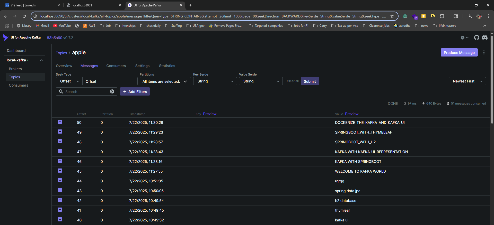
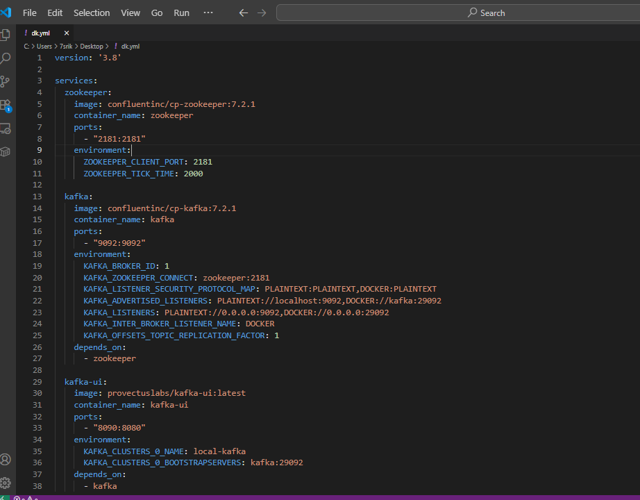
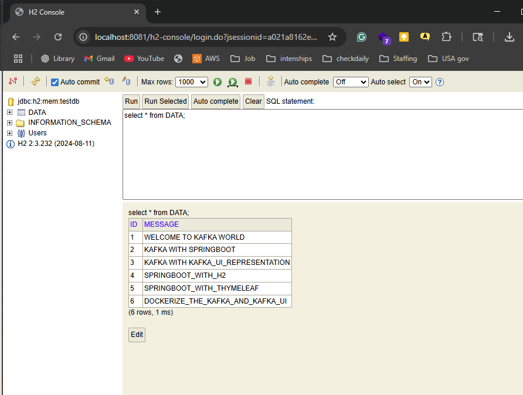
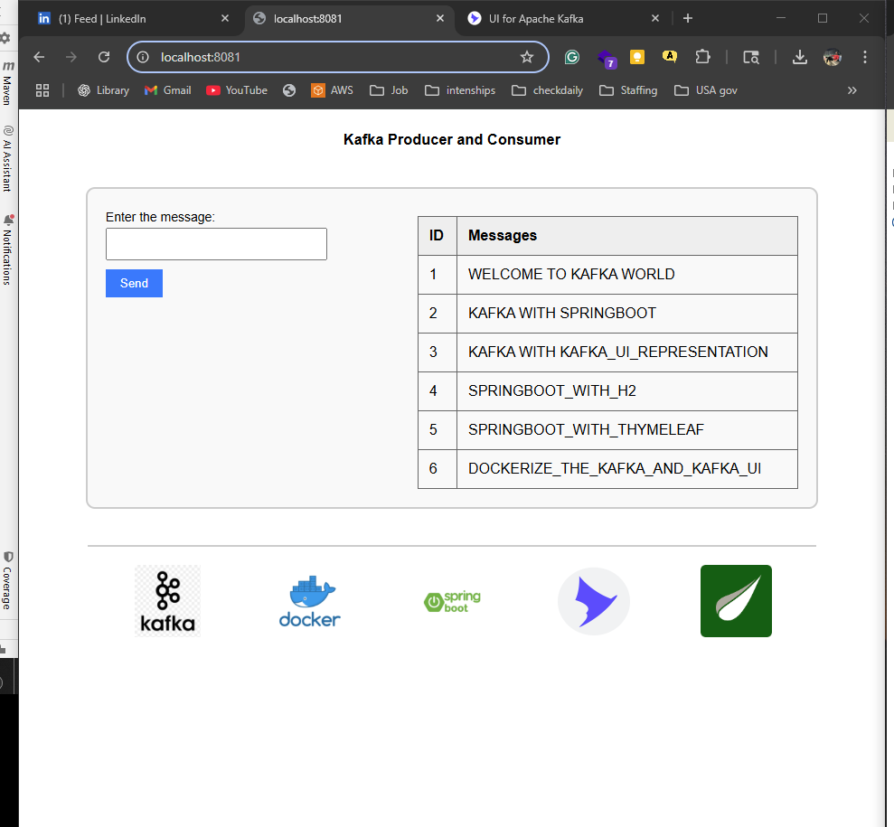

# 🧵 Spring Boot Kafka Messaging App with H2, Kafka UI, and Thymeleaf

A full-stack messaging application built using **Spring Boot**, **Kafka**, **H2 Database**, and **Thymeleaf**, with **Kafka and Kafka UI** running in **Docker containers**. This project simulates real-time producer-consumer communication using Kafka topics, persisting messages to an H2 database, and displaying them via a responsive Thymeleaf UI.


## 📌 Features

- 🔄 Send messages from UI ➝ Kafka Topic ➝ Consume ➝ Save to H2 ➝ Display on Webpage
- 🐳 Kafka + Kafka UI in Docker (Redpanda Labs Kafka UI)
- 🛠 Spring Boot REST Controller to interact with Kafka
- 🧠 In-memory H2 Database to store consumed messages
- 🎨 Thymeleaf frontend to send and view messages
- 💡 Clean separation of Producer, Consumer, Service, and Persistence logic

---

## ⚙️ Architecture Overview

```plaintext
User (HTML Form - Thymeleaf)
        |
        v
Spring Boot Controller
        |
        v
Kafka Producer -----> [Kafka Topic] <----- Kafka Consumer
                                |
                                v
                          Save to H2 DB
                                |
                                v
                        Display on Web UI
````

---

## 🚀 Technologies Used

* Java 17+
* Spring Boot
* Spring Kafka
* H2 Database (in-memory)
* Thymeleaf
* Kafka & Kafka UI (Docker)
* Maven

---

## 🐳 Kafka & Kafka UI Setup (Docker)

Use this `docker-compose.yml` to start Kafka and Kafka UI using Redpanda Labs UI:

version: '3.8'

services:
  zookeeper:
    image: confluentinc/cp-zookeeper:7.2.1
    container_name: zookeeper
    ports:
      - "2181:2181"
    environment:
      ZOOKEEPER_CLIENT_PORT: 2181
      ZOOKEEPER_TICK_TIME: 2000

  kafka:
    image: confluentinc/cp-kafka:7.2.1
    container_name: kafka
    ports:
      - "9092:9092"
    environment:
      KAFKA_BROKER_ID: 1
      KAFKA_ZOOKEEPER_CONNECT: zookeeper:2181
      KAFKA_LISTENER_SECURITY_PROTOCOL_MAP: PLAINTEXT:PLAINTEXT,DOCKER:PLAINTEXT
      KAFKA_ADVERTISED_LISTENERS: PLAINTEXT://localhost:9092,DOCKER://kafka:29092
      KAFKA_LISTENERS: PLAINTEXT://0.0.0.0:9092,DOCKER://0.0.0.0:29092
      KAFKA_INTER_BROKER_LISTENER_NAME: DOCKER
      KAFKA_OFFSETS_TOPIC_REPLICATION_FACTOR: 1
    depends_on:
      - zookeeper

  kafka-ui:
    image: provectuslabs/kafka-ui:latest
    container_name: kafka-ui
    ports:
      - "8090:8080"
    environment:
      KAFKA_CLUSTERS_0_NAME: local-kafka
      KAFKA_CLUSTERS_0_BOOTSTRAPSERVERS: kafka:29092
    depends_on:
      - kafka


Start Kafka and UI:

```bash
docker-compose   -f [your docerfle name ].yml   up  --build  -d 
```

Kafka UI will be accessible at [http://localhost:8085](http://localhost:8090)

---

## 🧪 How to Run This Project

### 🔨 Prerequisites

* Java 17+
* Maven
* Docker & Docker Compose (for Kafka and Kafka UI)

### ▶️ Steps to Run

1. **Start Kafka & Kafka UI**

   ```bash
   Run the above Docker command to start the images 
   ```

2. **Run Spring Boot Application**

   ```bash
   mvn spring-boot:run   //or direct run using IDE
   ```

3. **Access the Application**

   * Visit: [http://localhost:8080](http://localhost:8081)  //port depends the your application.properties mine at 8081

---

## 🌐 Sample Thymeleaf UI

* Input your message in the text box
* Click **Send**
* Message is sent to Kafka Topic → Consumed → Saved in H2 → Displayed on page

---

## 🖼 Screenshots (📸)

### 1. Kafka UI




### 2. Kafka Docker Running



### 3. H2 Database Console



### 4. Thymeleaf Web Page




## 📂 Project Structure (Simplified)

```
src   [this is a sample structure,   go through the src folder, you can see a similar  type 
├── main
│   ├── java/com/example/kafkaapp
│   │   ├── controller/MessageController.java
│   │   ├── kafka/Producer.java
│   │   ├── kafka/Consumer.java
│   │   ├── model/MessageData.java
│   │   ├── repository/MessageRepository.java
│   │   └── service/MessageService.java
│   └── resources
│       ├── templates/index.html
│       ├── static/images/
│       └── application.yml
```

---

## 🧠 Learning Outcomes

* Understanding end-to-end message flow using Kafka
* Using Kafka UI to monitor topics
* Connecting Kafka with Spring Boot
* Saving consumed data to H2 DB
* Creating simple UI using Thymeleaf

---

## 🙌 Author

**Shivakumar Polishetty**
🔗 [LinkedIn](https://www.linkedin.com/in/shivakumar-polishetty)

---

## 📃 License

This project is licensed under the MIT License.

---

## ✅ Future Enhancements

* Add support for Avro/JSON schema registry
* Enable external database like PostgreSQL or MongoDB
* Add Kafka Consumer group monitoring
* Dockerize Spring Boot App


